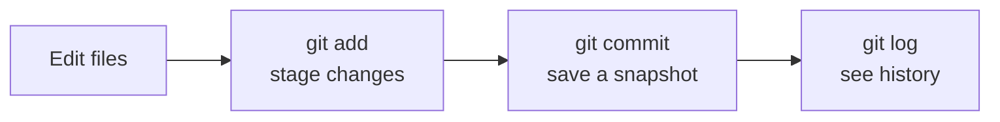

# Your First Repository and Commit

> **Level:** L0 · **Estimated time:** 20 min · **Prerequisites:** Git installed and configured

## 🎯 Objectives

By the end of this lesson you will be able to:

- Create a new Git repository on your computer
- Add a file and record your **first commit**
- Read the output of `git status` and `git log`

## 📖 Lesson

### Step 1 — Make a project folder

In your terminal, create and enter a new folder:

```bash
mkdir hello-git
cd hello-git
```

### Step 2 — Turn it into a repository

```bash
git init
```

This creates a hidden `.git` folder — that's where Git stores your history. Your folder is now
a **repository**. Check its state:

```bash
git status
```

Git will say there's nothing committed yet. That's expected.

### Step 3 — Create a file

Create a simple text file. You can use Kiro (open the `hello-git` folder as a workspace and add
a file), or the terminal:

```bash
echo "Hello, Git!" > README.md
```

Run `git status` again — Git now sees an **untracked** file called `README.md`.

### Step 4 — Stage the change

Before committing, you tell Git *which* changes to include by **staging** them:

```bash
git add README.md
```

:::note Why staging exists
Staging lets you choose exactly what goes into a commit. You might change five files but only
want to commit two of them together. `git add` puts changes into the "staging area", ready to
be committed.
:::

### Step 5 — Make your first commit

```bash
git commit -m "Add README with a greeting"
```

The text after `-m` is your **commit message** — a short note describing the change. 🎉
You just made your first commit!

### Step 6 — Look at your history

```bash
git log
```

You'll see your commit with its message, author (you!), and date. Press `q` to exit the log
view.

### A picture of what happened



## ✅ Checkpoint

- [ ] `git status` showed my untracked file before I added it.
- [ ] `git log` shows at least one commit with my message.
- [ ] I understand the flow: **edit → add → commit**.

## 🧪 Demo / Try it

Make a second change and commit it, so you can see history grow:

```bash
echo "Learning version control." >> README.md
git add README.md
git commit -m "Add a second line to the README"
git log --oneline
```

`git log --oneline` shows a compact, one-line-per-commit view. You should see **two** commits.

## ➡️ Next

You've finished Level 0 — congratulations! Continue to
**[Level 1 · Git & GitHub Fundamentals](/level-1)** to learn branches, remotes, and pushing to
GitHub.
