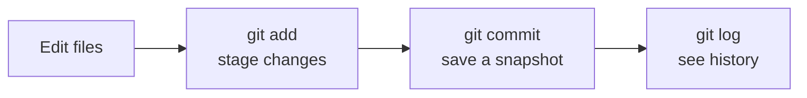

# Your First Repository and Commit

> **Level:** L0 · **Estimated time:** 20 min · **Prerequisites:** Git installed and configured

## What you'll get out of this lesson

This is the one where it stops being theory. You'll create a Git repository on your own machine, add
a file, record your first commit, and learn to read the output of `git status` and `git log`, which
are the two commands you'll run more than any others.

## Step 1 - Make a project folder

In your terminal, create a new folder and move into it:

```bash
mkdir hello-git
cd hello-git
```

Nothing Git-related has happened yet. It's just an ordinary empty folder.

## Step 2 - Turn it into a repository

```bash
git init
```

That single command creates a hidden `.git` folder inside `hello-git`, and that folder is where Git
quietly stores all of your history from now on. You won't need to open it, but it's worth knowing
it's there: delete it and you delete the repository. Your folder is now a **repository**. Ask Git
how things stand:

```bash
git status
```

Git will tell you there's nothing committed yet. That's not an error, it's just an honest report of
a brand-new, empty repo. Get used to running `git status` often; it's the command that answers
"what does Git think is going on right now?"

## Step 3 - Create a file

Add a simple text file. You can do this in Kiro (open the `hello-git` folder as a workspace and
create a new file), or straight from the terminal:

```bash
echo "Hello, Git!" > README.md
```

Run `git status` again. This time Git reports `README.md` as an **untracked** file. Untracked means
Git can see the file sitting there but isn't watching it yet. You have to tell Git you want it
included, which is the next step.

## Step 4 - Stage the change

Before you commit, you tell Git *which* changes belong in this snapshot by **staging** them:

```bash
git add README.md
```

:::note Why staging exists at all
When you first meet it, staging feels like an extra step for no reason. Here's the point: it lets
you choose exactly what goes into a commit. In real work you'll often change five files but want to
commit only two of them together as one clean, coherent change. `git add` puts the changes you name
into a holding area (the "staging area"), ready to be committed, and leaves the rest alone.
:::

## Step 5 - Make your first commit

```bash
git commit -m "Add README with a greeting"
```

The text after `-m` is your **commit message**, a short note describing what this change does. And
that's it. You just recorded your first commit. It's a small thing that turns out to be the
foundation for everything else in the course.

## Step 6 - Look at your history

```bash
git log
```

You'll see your commit listed with its message, its author (that's you), and a date. You'll also see
a long string of letters and numbers, which is the commit's unique ID. Press `q` to exit the log
view and return to your prompt. (If seeing a full-screen pager throws you the first time, that `q`
is the escape hatch worth remembering.)

## What actually happened, in one picture



That edit → add → commit loop is the rhythm of working with Git. You'll repeat it thousands of
times, and after a few dozen it stops feeling like steps and starts feeling like muscle memory.

## Quick self-check

- [ ] `git status` showed my untracked file before I added it.
- [ ] `git log` shows at least one commit with my message on it.
- [ ] I can describe the flow out loud: **edit, then add, then commit**.

## Try it

Make a second change and commit it, just to watch the history grow:

```bash
echo "Learning version control." >> README.md
git add README.md
git commit -m "Add a second line to the README"
git log --oneline
```

`git log --oneline` gives you the compact, one-commit-per-line view that you'll reach for constantly.
You should now see **two** commits stacked up. That short list is your project's story, and you're
the one writing it.

## Next

That's Level 0 done, and it's a real milestone. Continue to
**[Level 1 · Git & GitHub Fundamentals](/docs/level-1)** to pick up branches, remotes, and pushing
your work to GitHub.
