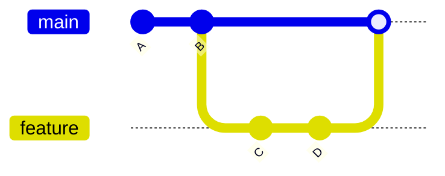

# Branches

> **Level:** L1 · **Estimated time:** 15 min · **Prerequisites:** commits lesson

## What you'll get out of this lesson

You'll understand what a branch is and why it's one of Git's best ideas, create and switch branches
with `git switch`, and merge a finished branch back into `main`.

## What a branch is, really

A **branch** is a movable pointer to a line of commits. That definition is accurate but a little dry,
so here's the practical version: a branch lets you work on a change in its own isolated space
without touching the main version of your project. The default branch is almost always called
**`main`**.

Think of `main` as the official, known-good version of your project, the one you'd be comfortable
showing someone. When you want to try something (a new feature, a risky fix, a wild idea) you make a
branch, do the work there, and only fold it back into `main` once you're happy with it. If the idea
turns out to be bad, you just abandon the branch and `main` never knew it happened. That freedom to
experiment without consequences is the whole appeal.



## Creating and switching

```bash
# Create a new branch and switch to it in one step
git switch -c add-contact-page

# See which branch you're on (the current one is marked with a *)
git branch
```

:::note `switch` versus the older `checkout`
If you follow along with older tutorials, you'll see `git checkout -b name` everywhere. The newer
`git switch -c name` does exactly the same thing, and it reads more clearly because `checkout` used
to do half a dozen unrelated jobs. Both still work; this course uses `switch`.
:::

## Do the work, then commit

On your new branch, make your changes and commit them exactly as you normally would. The key thing
to notice is that those commits live *only* on the branch. Switch back to `main` and it looks
untouched, because it is. That separation is the point.

## Merging back into main

When the work on your branch is ready to become official:

```bash
git switch main              # go back to main
git merge add-contact-page   # bring the branch's commits into main
```

If your branch and `main` changed different files (or different parts of the same file), Git merges
them cleanly and you're done. If they both changed the *same* lines, you get a **merge conflict**:
Git can't guess which version you want, so it marks the disputed spots and hands the decision to
you. Conflicts feel scary the first time, but they're routine, and you'll practice them properly in
Level 3 when you start collaborating.

## Cleaning up after yourself

Once a branch is merged, its job is done, so tidy it away:

```bash
git branch -d add-contact-page   # delete the merged branch
```

Leaving old merged branches lying around isn't dangerous, but it clutters `git branch` and makes it
harder to see what's actually in flight. A quick delete keeps things readable.

## Quick self-check

- [ ] I can create a branch with `git switch -c`.
- [ ] I can list branches and tell which one I'm currently on.
- [ ] I can merge a branch into `main`.

## Try it

Run through the whole cycle end to end:

```bash
git switch -c experiment
echo "Experimental note." >> README.md
git add README.md && git commit -m "Add experimental note"
git switch main
git merge experiment
git log --oneline
```

Look at that final log: the experiment's commit is now part of `main`'s history, exactly as if
you'd made it there all along.

## Next

Now let's get your repo connected to GitHub: **[Remotes: push & pull](./remotes-push-pull.md)**.
