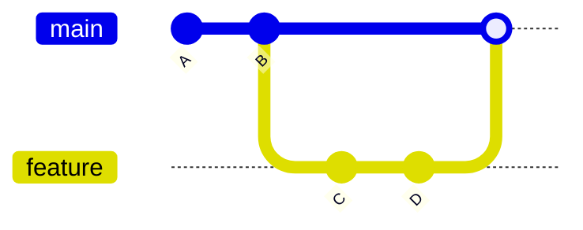

# Branches

> **Level:** L1 · **Estimated time:** 15 min · **Prerequisites:** commits lesson

## 🎯 Objectives

By the end of this lesson you will be able to:

- Explain what a branch is and why it's useful
- Create and switch branches with `git switch`
- Merge a branch back into `main`

## 📖 Lesson

### What is a branch?

A **branch** is a movable pointer to a line of commits. It lets you work on a change in
isolation without disturbing the main version of your project. The default branch is usually
called **`main`**.

Think of `main` as the "official" version. When you want to try something — a new feature, a
fix — you make a branch, do your work there, and only merge it back into `main` when it's ready.



### Creating and switching

```bash
# Create a new branch and switch to it in one step
git switch -c add-contact-page

# See which branch you're on (the current one has a *)
git branch
```

:::note `switch` vs `checkout`
Older tutorials use `git checkout -b name`. The newer `git switch -c name` does the same thing
and is clearer. Both work; we'll use `switch`.
:::

### Do some work, then commit

On your new branch, make changes and commit as usual. Those commits live on the branch only —
`main` is untouched.

### Merging back into main

When the work is ready:

```bash
git switch main          # go back to main
git merge add-contact-page   # bring the branch's commits into main
```

If the branches changed different things, Git merges cleanly. If they changed the *same* lines,
you get a **merge conflict** — Git marks the spots and you choose what to keep. You'll practice
conflicts and collaboration in Level 3.

### Cleaning up

```bash
git branch -d add-contact-page   # delete the merged branch
```

## ✅ Checkpoint

- [ ] I can create a branch with `git switch -c`.
- [ ] I can list branches and tell which one I'm on.
- [ ] I can merge a branch into `main`.

## 🧪 Demo / Try it

```bash
git switch -c experiment
echo "Experimental note." >> README.md
git add README.md && git commit -m "Add experimental note"
git switch main
git merge experiment
git log --oneline
```

You should see the experiment's commit now in `main`'s history.

## ➡️ Next

Connect your repo to GitHub: **[Remotes: push & pull](./remotes-push-pull.md)**.
