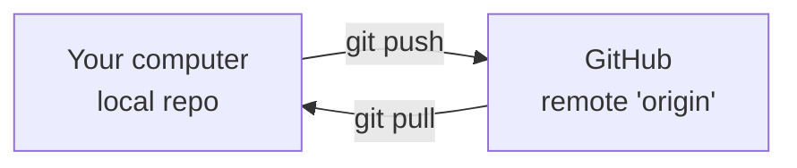

# Remotes: Push & Pull

> **Level:** L1 · **Estimated time:** 18 min · **Prerequisites:** branches lesson, a GitHub account

## 🎯 Objectives

By the end of this lesson you will be able to:

- Explain what a **remote** is
- Create a repository on GitHub and connect it to your local repo
- **Push** local commits to GitHub and **pull** changes back
- **Clone** an existing repository

## 📖 Lesson

### What is a remote?

A **remote** is a version of your repository hosted elsewhere — for us, on GitHub. The default
remote is conventionally named **`origin`**. You **push** your local commits *up* to the remote
and **pull** others' commits *down*.



### Option A — Start on GitHub, then clone

This is the easiest way to begin a brand-new project.

1. On GitHub, select **New** to create a repository. Give it a name (e.g. `hello-github`),
   keep it **Public**, and tick **Add a README**.
2. On the repo page, select **Code** and copy the **HTTPS** URL.
3. **Clone** it to your computer (downloads the repo *and* its history):

   ```bash
   git clone https://github.com/<your-username>/hello-github.git
   cd hello-github
   ```

`clone` automatically sets up the `origin` remote for you.

### Option B — Connect an existing local repo

If you already have a local repo (like `hello-git` from Level 0):

1. Create an **empty** repository on GitHub (do *not* add a README).
2. Connect and push:

   ```bash
   git remote add origin https://github.com/<your-username>/hello-git.git
   git branch -M main
   git push -u origin main
   ```

The `-u` sets `origin/main` as the default, so later you can just run `git push`.

### The everyday sync loop

```bash
git pull            # get the latest from GitHub before you start
# ...make changes, git add, git commit...
git push            # send your commits to GitHub
```

:::warning Pull before you push
If someone else (or you, on another machine) pushed changes, always `git pull` first. Pushing
onto out-of-date history is rejected — pulling brings you up to date.
:::

:::note Authentication
The first time you push over HTTPS, GitHub asks you to authenticate. Use a **Personal Access
Token** (Settings → Developer settings → Tokens) as the password, or sign in through Kiro's/your
system's Git credential helper. GitHub no longer accepts your account password on the command
line.
:::

## ✅ Checkpoint

- [ ] I can explain what `origin` is.
- [ ] I pushed local commits to GitHub and can see them on the repo page.
- [ ] I can clone a repository.

## 🧪 Demo / Try it

Create a repo on GitHub, clone it, add a file, and push:

```bash
git clone https://github.com/<your-username>/hello-github.git
cd hello-github
echo "Hello from my computer" > notes.txt
git add notes.txt
git commit -m "Add notes file"
git push
```

Refresh the repo page on GitHub — `notes.txt` should appear.

## ➡️ Next

Keep clutter out of your history: **[Ignoring files with .gitignore](./gitignore.md)**.
