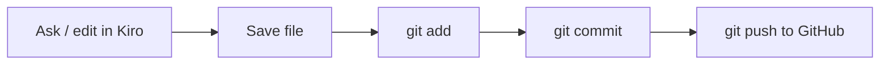

# Reading & Editing Code

> **Level:** L2 · **Estimated time:** 12 min · **Prerequisites:** chatting with Kiro

## What you'll get out of this lesson

You'll open and read a file, make a small edit (by hand or through Kiro), and commit the change using
the Git workflow you already learned in Level 1. The theme here is that editing is only half the
job; the commit is what makes it stick.

## Reading a file

Click any file in the explorer and it opens in the editor. That covers the simple case. When a file
is long or unfamiliar, though, you have a second option: ask Kiro to summarize it or explain a
particular function. This is genuinely useful when you land in someone else's code and need the gist
before you touch anything. Reading with a guide beats scrolling and hoping.

## Two ways to edit, and why you'd mix them

You can edit **directly** by typing in the editor and saving with `Ctrl/Cmd + S`, or you can edit
**with Kiro** by describing the change in chat, letting Kiro propose an edit, and reviewing it before
you apply.

Neither is "the right one." Early on, deliberately mixing the two is one of the fastest ways to
learn: let Kiro draft something, then read the result closely to understand *why* it works the way
it does. Over time you'll develop a feel for which changes are quicker to just type and which are
worth describing.

## Closing the loop with Git

Here's the part people forget in the excitement of editing: a saved file is not a saved *version*.
Remember Level 1. After a meaningful change, run the loop:

```bash
git status                       # see what changed
git add index.html               # stage it
git commit -m "Add welcome copy" # save a snapshot
```

You can run all of this in Kiro's integrated terminal without ever leaving your workspace, which is
one of the small conveniences that adds up over a project.



:::tip Small, reviewable commits
Make one logical change, then commit it. A history made of small, focused commits is a history you
can actually read, and it means you can undo a single mistake later without unpicking three unrelated
changes tangled into one commit.
:::

## Quick self-check

- [ ] I opened and read a file.
- [ ] I made and saved an edit.
- [ ] I committed the change with a clear message.

## Try it

Open your project's `README.md` (or any file), add a line, save it, then commit:

```bash
git add README.md
git commit -m "Add a note to the README"
```

Small as it is, that's the complete edit-then-record loop you'll run for the rest of the course.

## Next

Time to build something real: **[Scaffold the project app](./scaffold-the-project.md)**.
