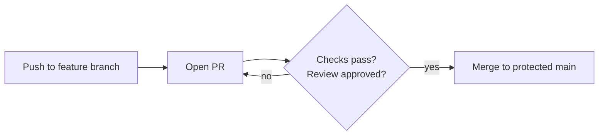

# Branch Protection Basics

> **Level:** L3 · **Estimated time:** 12 min · **Prerequisites:** code review

## 🎯 Objectives

By the end of this lesson you will be able to:

- Explain why protecting `main` matters
- Turn on a basic branch protection rule
- Require pull requests and passing checks before merge

## 📖 Lesson

### Why protect `main`?

`main` is your "official" version — ideally always working. **Branch protection** stops anyone
(including you) from pushing directly to `main` and forces changes through a reviewed,
CI-checked pull request. This prevents accidental breakage.

### Turning it on

On GitHub: **Settings** → **Branches** → **Add branch ruleset** (or "Add rule"). Target the
`main` branch and enable rules such as:

- **Require a pull request before merging** — no direct pushes to `main`.
- **Require status checks to pass** — e.g. your lint / grader / project checks must be green.
- **Require branches to be up to date before merging** — pull latest before merge.
- Optionally **Require approvals** — at least one review (great for teams).

### The effect

After enabling protection, trying to `git push` straight to `main` is rejected. You'll branch,
open a PR, let checks run, and merge — exactly the flow you practiced.

:::note Solo projects benefit too
Protection isn't just for teams. On a solo project it enforces good habits and ensures your own
CI has to pass before code reaches `main`.
:::

## ✅ Checkpoint

- [ ] I enabled a branch protection rule / ruleset on `main`.
- [ ] Direct pushes to `main` are blocked.
- [ ] Merging requires a PR (and passing checks).

## 🧪 Demo / Try it

Enable "Require a pull request before merging" on `main`, then try `git push origin main`
directly — GitHub should reject it, nudging you to use a PR.

## ➡️ Next

Put it all together: **[🧪 Lab: add a feature via a PR](./lab.md)**.
