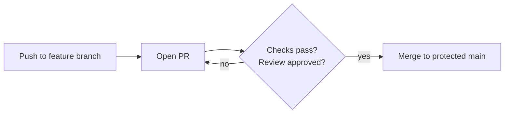

# Branch Protection Basics

> **Level:** L3 · **Estimated time:** 12 min · **Prerequisites:** code review

## What you'll get out of this lesson

You'll understand why protecting `main` matters, turn on a basic protection rule, and require that
changes go through a pull request that passes its checks before it can merge.

## Why lock down `main` at all

`main` is your official version, the branch that should always work. The trouble is that "always
works" relies on everyone remembering to be careful, and people (including you, at 6pm on a Friday)
forget. **Branch protection** removes the need to remember. It stops anyone from pushing directly to
`main` and forces every change through a pull request that's been reviewed and checked by CI. One
tired direct push can't quietly break the build anymore, because the direct push simply isn't
allowed.

## Turning it on

On GitHub, go to **Settings → Branches → Add branch ruleset** (older repos may say "Add rule"). Point
it at the `main` branch and switch on the rules that matter most:

**Require a pull request before merging** blocks direct pushes to `main` outright. **Require status
checks to pass** means your lint, grader, or project checks have to be green before merge. **Require
branches to be up to date before merging** forces you to pull the latest before you can merge, which
avoids merging against stale code. And optionally, **Require approvals** demands at least one review,
which is essential on a team and a nice discipline even alone.

## What changes afterward

The next time you try to `git push` straight to `main`, GitHub rejects it. That rejection is the
feature working, not a bug. From now on the path is the one you just practiced: branch, open a PR,
let the checks run, and merge. It's a small amount of friction that buys a large amount of safety.

:::note Solo projects benefit too
It's easy to assume protection is a team-only thing, but it's arguably even more valuable solo. When
there's no one else to catch you, a protected `main` is the only thing enforcing that your own CI has
to pass before code becomes official. It's you, protecting you, from you.
:::

## Quick self-check

- [ ] I enabled a branch protection rule or ruleset on `main`.
- [ ] Direct pushes to `main` are blocked.
- [ ] Merging requires a PR and passing checks.

## Try it

Enable "Require a pull request before merging" on `main`, then deliberately try `git push origin main`
from a local change. GitHub should refuse it and point you toward opening a PR instead. Seeing the
rejection first-hand is the best way to trust that the guardrail is really there.

## Next

Put the whole workflow together: **[Lab: add a feature via a PR](./lab.md)**.
