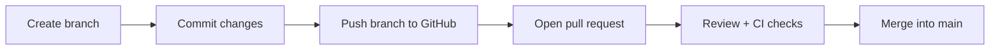

# Pull Requests

> **Level:** L3 · **Estimated time:** 15 min · **Prerequisites:** branches (L1), issues

## 🎯 Objectives

By the end of this lesson you will be able to:

- Explain what a **pull request (PR)** is
- Open a PR from a branch
- Write a helpful PR description

## 📖 Lesson

### What is a pull request?

A **pull request** proposes merging the commits on one branch into another (usually into
`main`). It's a place to **review**, **discuss**, and **run automated checks** on a change
*before* it becomes part of the main version.



### The PR workflow

1. Create a branch and commit your work (Level 1 skills):

   ```bash
   git switch -c add-about-section
   # ...edit files...
   git add .
   git commit -m "Add About section to homepage"
   git push -u origin add-about-section
   ```

2. On GitHub, you'll see a prompt to **Compare & pull request**. Click it.
3. Fill in the PR:
   - **Title:** short summary of the change.
   - **Description:** what changed and why; link the issue with `Fixes #123`.
4. Open the PR. Any configured **CI checks** (like our graders) run automatically.

### A good PR description

- What does this change and why?
- How can a reviewer test it?
- Anything to watch out for?

Keeping PRs **small and focused** makes them faster to review and safer to merge.

:::note Draft PRs
Not ready for review? Open it as a **Draft** to share progress and run CI without requesting a
review yet.
:::

## ✅ Checkpoint

- [ ] I can push a branch and open a PR from it.
- [ ] My PR has a clear title and description.
- [ ] I linked an issue with a closing keyword.

## 🧪 Demo / Try it

Push a branch with a small change to your project repo and open a PR. Notice the checks that run
at the bottom of the PR page.

## ➡️ Next

**[Code review](./code-review.md)**.
