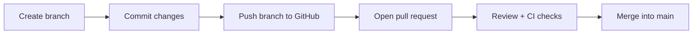

# Pull Requests

> **Level:** L3 · **Estimated time:** 15 min · **Prerequisites:** branches (L1), issues

## What you'll get out of this lesson

You'll understand what a **pull request** is, open one from a branch, and write a description that
makes a reviewer's job easy instead of frustrating.

## What a pull request is

A **pull request** (everyone says "PR") proposes merging the commits on one branch into another,
almost always into `main`. But calling it "a merge request" undersells it. A PR is really a
dedicated space to **review**, **discuss**, and **automatically check** a change *before* it becomes
part of the official version of your project. It's the checkpoint between "I made a change" and "this
change is now part of what everyone builds on."



## The workflow, start to finish

It builds directly on the branching you learned in Level 1:

1. Create a branch and commit your work:

   ```bash
   git switch -c add-about-section
   # ...edit files...
   git add .
   git commit -m "Add About section to homepage"
   git push -u origin add-about-section
   ```

2. Push the branch, and GitHub notices. It shows a **Compare & pull request** prompt; click it.
3. Fill in the PR. Give it a **title** that summarizes the change, and a **description** covering
   what changed and why. If it resolves an issue, link it with `Fixes #123` so the issue closes on
   merge.
4. Open the PR. Any **CI checks** configured on the repo (like the course graders) start running
   automatically, and you'll see them collect at the bottom of the page.

## What a good description gives a reviewer

A reviewer arrives knowing nothing about what you were thinking. A good description fills that gap by
answering three questions: what does this change, and why? How can I test or verify it? And is there
anything I should watch out for? Even one sentence for each transforms the review from a guessing
game into a quick, confident yes.

The other half of a reviewable PR is size. A PR that touches four files is a five-minute review; one
that touches forty is a chore that gets rubber-stamped or left to rot. Keeping PRs **small and
focused** is the single biggest favor you can do the person reviewing them, and that person is often
future you.

:::note Draft pull requests
Not ready for eyes yet but want to run CI or share progress? Open the PR as a **Draft**. It runs the
checks and shows your work without formally requesting a review, which is perfect for "here's where
I'm at, does this direction look right?"
:::

## Quick self-check

- [ ] I can push a branch and open a PR from it.
- [ ] My PR has a clear title and a real description.
- [ ] I linked an issue with a closing keyword.

## Try it

Push a branch with a small change to your project repo and open a PR from it. Scroll to the bottom of
the PR page and watch the checks run. Seeing your own automated checks turn green (or red) is the
moment CI stops being an abstract idea.

## Next

**[Code review](./code-review.md)**.
