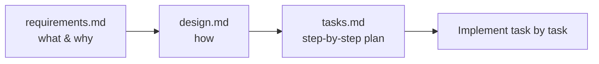

# Spec-Driven Development

> **Level:** L5 · **Estimated time:** 18 min · **Prerequisites:** steering files

## 🎯 Objectives

By the end of this lesson you will be able to:

- Explain what a **spec** is and its three parts
- Read a requirements → design → tasks flow
- Use a spec to implement a feature step by step

## 📖 Lesson

### What is a spec?

A **spec** is a structured way to build a feature with Kiro. Instead of one big prompt, you
capture the feature as three documents in `.kiro/specs/<feature-name>/`:

| File | Purpose |
|------|---------|
| `requirements.md` | User stories and acceptance criteria — *what* and *why* |
| `design.md` | The technical approach — *how* |
| `tasks.md` | A checklist of small, ordered implementation steps |

### Why bother?

- **Clarity:** you think through the change before writing code.
- **Control:** you implement one task at a time and review each.
- **Traceability:** tasks link back to requirements, so nothing is missed.

This is ideal for anything non-trivial — and a fantastic habit even on small features.

### A real example in this repo

The [`.kiro/specs/contact-section/`](https://github.com/your-username/github-kiro-course/tree/main/.kiro/specs/contact-section)
folder contains a complete spec for adding a Contact section to the project:

- `requirements.md` — two requirements with acceptance criteria.
- `design.md` — the exact markup and styling approach.
- `tasks.md` — four ordered tasks, each linked to requirements.

### Working through it

With a spec open, you implement **one task at a time**: do the task, verify it, check it off,
then move on. Each task references the requirements it satisfies, so you always know *why*
you're doing it.

:::note Spec files can reference others
Like steering, spec files can include `#[[file:...]]` references — handy for pointing at an API
schema or a design doc.
:::

## ✅ Checkpoint

- [ ] I can name the three spec files and their purpose.
- [ ] I can read acceptance criteria and map a task to them.
- [ ] I understand implementing one task at a time.

## 🧪 Demo / Try it

Open the three files in `.kiro/specs/contact-section/`. Then implement **Task 1** (add the
Contact section markup) in `project/index.html`, following the design. Verify with
`node project/scripts/check-static-site.js`.

## ➡️ Next

**[Agent hooks](./hooks.md)**.
