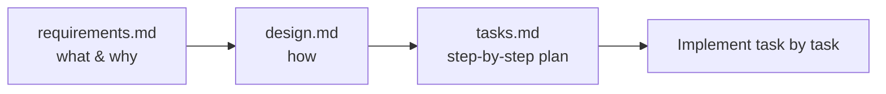

# Spec-Driven Development

> **Level:** L5 · **Estimated time:** 18 min · **Prerequisites:** steering files

## What you'll get out of this lesson

You'll understand what a **spec** is and its three parts, read a requirements-to-design-to-tasks flow,
and use a spec to implement a feature one step at a time.

## What a spec is, and why not just prompt

You *can* ask Kiro to "build me a contact form" in one big prompt, and for tiny changes that's fine.
But for anything with a bit of substance, that approach tends to produce a wall of code you then have
to review all at once, hoping it matches what you had in mind. A **spec** is the more deliberate
alternative. It captures a feature as three documents in `.kiro/specs/<feature-name>/`, each answering
a different question:

| File | Purpose |
|------|---------|
| `requirements.md` | User stories and acceptance criteria: the *what* and the *why* |
| `design.md` | The technical approach: the *how* |
| `tasks.md` | A checklist of small, ordered implementation steps |

## Why the extra structure is worth it

The three documents buy you three things that a single prompt can't. You get **clarity**, because
writing down what you actually want forces you to think the change through before any code exists. You
get **control**, because you implement one task at a time and review each in isolation rather than
facing a huge diff. And you get **traceability**, because each task points back to the requirement it
satisfies, so nothing quietly falls through the cracks.

It's ideal for anything non-trivial, and honestly it's a good habit even on small features, in the
same way writing an issue before coding is.

## The example already in this repo

The [`.kiro/specs/contact-section/`](https://github.com/HybridCloudWorks/Demo-GitHub_and_Kiro/tree/main/.kiro/specs/contact-section)
folder holds a complete, real spec for adding a Contact section to the project. Inside you'll find
`requirements.md` with two requirements and their acceptance criteria, `design.md` describing the exact
markup and styling approach, and `tasks.md` breaking the work into four ordered tasks, each linked back
to a requirement.

## How you actually work through it

With a spec open, the rhythm is simple and calming: implement **one task**, verify it works, check it
off, and move to the next. Because each task references the requirements it satisfies, you always know
*why* you're doing the thing in front of you, which keeps you from wandering off into unrelated
"while I'm here" changes.

:::note Specs can reference other files too
Just like steering, spec files support `#[[file:...]]` references, which is handy for pointing at an
API schema or a design doc so it informs the work without being copied in.
:::

## Quick self-check

- [ ] I can name the three spec files and what each is for.
- [ ] I can read acceptance criteria and map a task to them.
- [ ] I understand the "implement one task at a time" rhythm.

## Try it

Open the three files in `.kiro/specs/contact-section/` and read them in order. Then implement **Task 1**
(adding the Contact section markup) in `project/index.html`, following the design doc rather than
improvising. Verify your work with `node project/scripts/check-static-site.js`. Notice how much easier
the change is when someone (past you, via the spec) already decided what "done" looks like.

## Next

**[Agent hooks](./hooks.md)**.
