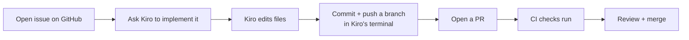

# Kiro × GitHub Integration

> **Level:** L6 · **Estimated time:** 25 min · **Prerequisites:** custom agents; a GitHub repo

## What you'll get out of this lesson

You'll combine Kiro with your GitHub workflow end to end, use the integrated terminal (and optionally
the `gh` CLI) for Git and GitHub tasks, and see how a GitHub MCP server can go a step further as a
stretch goal.

## The two halves, working together

You've learned all these pieces separately. The point of this lesson is to see them as one motion:
Kiro helps you *write* the change, and GitHub helps you *review and ship* it. Neither replaces the
other; they hand off cleanly.



## Doing it for real

1. **Issue:** create one on GitHub describing the change, something like "Add a projects list."
2. **Implement with Kiro:** in your workspace, ask Kiro to make the change and mention the issue for
   context. Read the edits it proposes before accepting; the review habit from Level 2 still applies.
3. **Branch and commit,** right in Kiro's integrated terminal:

   ```bash
   git switch -c add-projects-list
   git add .
   git commit -m "Add projects list to homepage"
   git push -u origin add-projects-list
   ```

4. **PR:** open the pull request and link the issue with `Fixes #n`. Watch CI run at the bottom of the
   page.
5. **Merge:** once it's green and reviewed, merge it.

The thing to notice is how little context-switching there is. You never left Kiro to write the code or
push the branch, and you only touched the browser for the parts (review, merge) that genuinely belong
there.

## The `gh` CLI, if you want it

GitHub's official command-line tool, [`gh`](https://cli.github.com/), lets you handle GitHub tasks
right from the terminal Kiro gives you, without reaching for the browser at all:

```bash
gh issue create --title "Add a projects list" --body "..."
gh pr create --fill
gh pr status
```

For people who like staying on the keyboard, this can make the whole loop faster. It's entirely
optional, though.

## Stretch: a GitHub MCP server

If you want deeper automation, you can add a **GitHub MCP server** so Kiro can read issues and pull
requests directly, rather than you relaying their contents. This needs a GitHub **token** and a server
entry in your `mcp.json`. It's a rewarding stretch goal, but do note that everything above works
perfectly well without it, so don't feel you have to set it up to finish the level.

:::warning Treat tokens like passwords
If you use a GitHub token, whether for `gh` or an MCP server, guard it the way you'd guard a password.
Never commit it to a repo, store it where the tool expects (an environment variable or credential
store), and give it only the scopes it actually needs. A leaked token with broad scopes is a genuinely
bad day.
:::

## Quick self-check

- [ ] I moved a change from issue, to Kiro edit, to branch, to PR, to merge.
- [ ] I used the integrated terminal for Git and GitHub commands.
- [ ] (Stretch) I explored `gh` or a GitHub MCP server.

## Try it

Pick a small, real improvement to the project. Open an issue for it, then take it all the way to a
merged PR: use Kiro to make the edit and the integrated terminal to push. Doing one change through the
complete loop, without hopping between five different windows, is the payoff of everything in this
level.

## Next

Now prove it: **[Lab: configure an MCP server](./lab.md)**.
