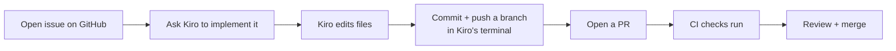

# Kiro × GitHub Integration

> **Level:** L6 · **Estimated time:** 25 min · **Prerequisites:** custom agents; a GitHub repo

## 🎯 Objectives

By the end of this lesson you will be able to:

- Combine Kiro with your GitHub workflow end to end
- Use the integrated terminal (and optionally the `gh` CLI) for Git/GitHub tasks
- Let an MCP GitHub server (stretch) help with issues and PRs

## 📖 Lesson

### The combined workflow

You've learned the pieces separately. Here they are together — Kiro helps you *write* the change,
GitHub helps you *review and ship* it:



### Doing it hands-on

1. **Issue:** create one on GitHub describing the change (e.g. "Add a projects list").
2. **Implement with Kiro:** in your workspace, ask Kiro to make the change, referencing the
   issue. Review the edits.
3. **Branch + commit:** in Kiro's integrated terminal:

   ```bash
   git switch -c add-projects-list
   git add .
   git commit -m "Add projects list to homepage"
   git push -u origin add-projects-list
   ```

4. **PR:** open the pull request (link the issue with `Fixes #n`). Watch CI run.
5. **Merge:** once green and reviewed, merge.

### The `gh` CLI (optional)

GitHub's official CLI, [`gh`](https://cli.github.com/), lets you do GitHub tasks from the
terminal Kiro provides:

```bash
gh issue create --title "Add a projects list" --body "..."
gh pr create --fill
gh pr status
```

### Stretch: a GitHub MCP server

For deeper automation you can add a **GitHub MCP server** so Kiro can read issues and PRs
directly. This requires a GitHub **token** and configuring the server in `mcp.json`. It's a great
stretch goal — but everything above works without it.

:::warning Protect your tokens
If you use a GitHub token (for `gh` or an MCP server), treat it like a password. Never commit it;
store it where the tool expects (environment/credential store), and give it only the scopes it
needs.
:::

## ✅ Checkpoint

- [ ] I moved a change from issue → Kiro edit → branch → PR → merge.
- [ ] I used the integrated terminal for Git/GitHub commands.
- [ ] (Stretch) I explored `gh` or a GitHub MCP server.

## 🧪 Demo / Try it

Pick a small improvement to the project, open an issue, and take it all the way to a merged PR —
using Kiro to make the edit and the terminal to push.

## ➡️ Next

Prove it: **[🧪 Lab: configure an MCP server](./lab.md)**.
